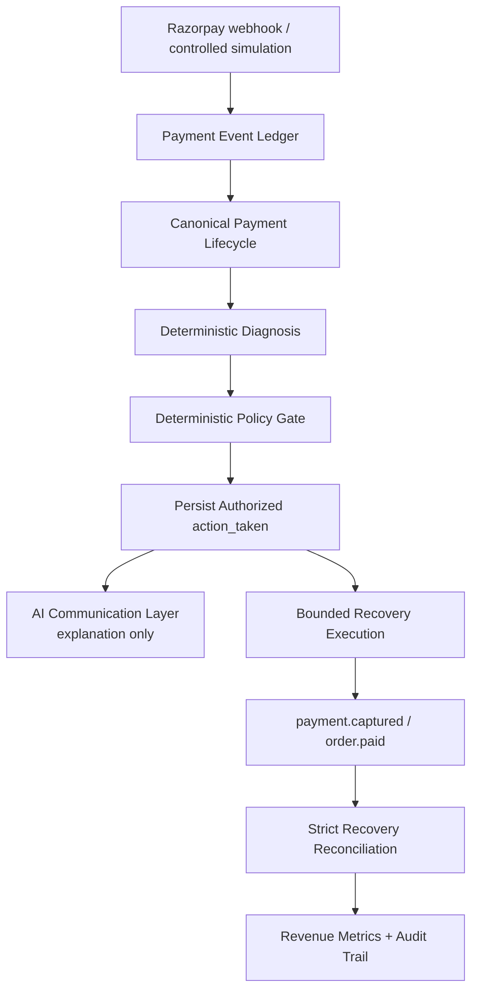

# AI Revenue Recovery

## Problem

Payment failures create revenue at risk. Retrying every failure automatically
is unsafe: it can repeat unsuccessful attempts and create a poor customer
experience.

## Solution

AI Revenue Recovery is a FastAPI + SQLite demonstration of a bounded recovery
workflow that:

1. detects payment failures
2. derives canonical payment lifecycle state
3. diagnoses failures deterministically
4. applies a deterministic policy gate
5. executes only the persisted, authorized action
6. uses NVIDIA NIM for explanation and customer communication
7. reconciles successful payment capture
8. measures captured, recovered, and still-at-risk revenue
9. records an auditable decision trail

The project uses Razorpay Test Mode when credentials are configured. It also
includes controlled simulations and an offline synthetic batch experiment.

## What Broke — And How We Got Out

During real Razorpay Test Mode integration, we found that a Payment Link
could appear usable while already being associated with an older recovery
case. We also encountered webhook-tunnel failures during live testing.

We did not weaken financial reconciliation to make the demo pass.

Instead, the system was hardened to fail closed:
- an already locally bound Payment Link is rejected;
- existing recovery metadata in Razorpay notes is rejected;
- amount and currency must match;
- successful recovery requires validated payment/link identity;
- ambiguous matches are recorded but never attributed to a recovery case.

The webhook issue was isolated to the transport layer rather than being
"fixed" by weakening payment validation. We replaced the failed tunnel and
verified that Razorpay events reached the same FastAPI webhook handler.

These failures improved the system's core principle: recover revenue when it
is safe to do so, and stop when payment ownership cannot be proven.

## Why AI — and Why Not AI for Money Movement

The system does **not** ask an LLM, “Should we retry this payment?”

AI is used only for:

- explaining a diagnosed case
- drafting customer communication
- producing an internal note

Deterministic application code controls:

- diagnosis classification
- recovery authorization
- retry limits
- cancellation handling
- manual escalation
- payment-link behavior
- successful-payment reconciliation
- revenue accounting

The invariant is:

```text
diagnosis → policy → persisted action_taken → recovery
```

The recovery service executes the persisted policy action. AI cannot authorize
or execute a financial action.

## Architecture



AI is deliberately a communication layer between policy persistence and the
user-facing/internal explanation. It is not the financial authority.

## Payment Lifecycle

The `payment_events` ledger records lifecycle events without replacing the
existing webhook idempotency table.

| Event/state | Meaning |
|---|---|
| `payment.failed` | Failure evidence that can create a recovery case |
| `payment.authorized` | Authorization evidence, but not captured revenue |
| `payment.captured` | Authoritative successful payment evidence |
| `order.paid` | Successful lifecycle evidence when capture is unavailable |
| `payment_link.paid` | Successful payment-link recovery event |
| `CHECKOUT_ABANDONED` | Checkout was dismissed; it is not proof of payment failure |

`payment.captured` and `order.paid` are canonicalized so one successful
payment cannot double-count revenue. Simulation events are stored with
`source=simulation`; real Razorpay webhooks use
`source=razorpay_webhook`. The checkout success callback is not authoritative:
the frontend waits for server-confirmed lifecycle state.

## Diagnosis

The deterministic taxonomy has three categories:

- `temporary_issuer_failure`
- `customer_cancelled`
- `unknown_failure`

Strong evidence of a temporary issuer, bank, gateway, or technical problem can
enter the retryable policy path. Explicit customer cancellation permits a
reminder/payment-link path, not automatic retry. Ambiguous or generic failures
become `unknown_failure` and go to manual review. Uncertainty intentionally
defaults toward safety; this is not probabilistic ML diagnosis.

## Policy & Safety

Diagnosis recommends a path but does not authorize it. The policy gate persists
the authorized `action_taken`, and recovery executes only that value.

Safety rules include:

- retries are bounded by the case maximum
- customer cancellations never receive automatic retry
- unknown failures escalate to manual review
- recovered cases are not processed again
- duplicate success signals cannot increase recovered revenue
- policy violations are calculated from persisted case state

## AI / NVIDIA NIM

The optional provider is NVIDIA NIM:

- Model: `nvidia/nemotron-3.5-lightning-30b-a3b`
- Output: `summary`, `recommended_message`, `customer_action`, `internal_note`

NIM cannot authorize retries, change retry counts, choose amounts, create
payment links, authorize refunds or credits, or claim recovery without
verified payment state.

If NIM is disabled, unavailable, malformed, or unsafe, the application uses
deterministic template communication and continues the recovery workflow.

## Revenue Accounting

These measures are intentionally separate:

- **Captured Revenue**: all successfully captured payments
- **Recovered Revenue**: previously at-risk revenue subsequently recovered
- **Revenue Still at Risk**: unresolved at-risk recovery cases

For recovery cases, the accounting identity is:

```text
revenue_at_risk =
revenue_recovered + revenue_still_at_risk
```

Amounts are stored and reconciled internally as integer paise, then converted
to rupees for presentation. A normal successful payment contributes to
Captured Revenue but not Recovered Revenue unless it safely matches an
existing at-risk case.

Successful reconciliation uses strict identifiers:

1. exact `payment_id`
2. `order_id` only when the match is unambiguous
3. never amount-only matching
4. never customer-only matching
5. never fuzzy matching

An ambiguous success remains in the lifecycle ledger but does not incorrectly
mark a recovery case as recovered.

## 50-Case Synthetic Demo

The batch is a **synthetic / controlled experiment**, not production
performance and not a claim about Razorpay recovery rates. It uses a fixed
seed, deterministic scenario generation, and deterministic synthetic recovery
confirmations.

It reports:

- payments processed
- revenue at risk
- diagnosis distribution
- authorized retries, reminders, and manual reviews
- retry attempts
- successful recoveries
- recovered revenue
- revenue still at risk
- recovery rate
- policy violations

The default seed is `20260829`. Run from the repository root:

```powershell
python -m scripts.run_batch_demo
python -m scripts.run_batch_demo --json
python -m scripts.run_batch_demo --seed 12345 --json
```

The JSON report includes `mode=synthetic_demo`,
`recovery_mode=synthetic_confirmation`, seed, paise fields, presentation
values in rupees, and the accounting/policy results.

## Judge Demo

1. Open `/dashboard`.
2. Show Revenue at Risk, Captured Revenue, Recovered Revenue, Still at Risk,
   Recovery Rate, and Cases Processed.
3. Point out **CONTROLLED FAILURE SIMULATION**.
4. Trigger a temporary issuer failure.
5. Show deterministic diagnosis and the policy-authorized bounded retry.
6. Use the recovery simulation or a confirmed payment event.
7. Show the case transition to **RECOVERED** and the recovered amount.
8. Open the audit trail and follow detection → diagnosis → policy → action →
   payment success → recovery confirmation.
9. Run the 50-case demo and show its **SYNTHETIC DEMO** result card, seed,
   accounting, recovery mode, and policy-violation count.
10. Point out that AI explains and drafts communication; policy controls money
    movement.

The checkout page is a Razorpay Test Mode flow. Its client callback says
“Payment submitted” and waits for backend confirmation; dismissing the modal
means `CHECKOUT_ABANDONED`, not `payment.failed`.

## Setup

The project expects Python 3.11+ and has been developed with a local virtual
environment.

```powershell
python -m venv venv
.\venv\Scripts\Activate.ps1
python -m pip install -r requirements.txt
Copy-Item .env.example .env
python -m uvicorn main:app --reload
```

Open:

- Dashboard: `http://127.0.0.1:8000/`
- Checkout: `http://127.0.0.1:8000/checkout`

Configuration is loaded from `.env`:

| Variable | Purpose |
|---|---|
| `RAZORPAY_KEY_ID` | Razorpay Test Mode public key |
| `RAZORPAY_KEY_SECRET` | Razorpay Test Mode server secret |
| `RAZORPAY_WEBHOOK_SECRET` | Webhook signature verification secret |
| `AI_ENABLED` | Set `true` to enable optional NIM communication |
| `AI_PROVIDER` | Use `nim` for NVIDIA NIM |
| `NIM_API_KEY` | Local NVIDIA NIM API key |
| `NIM_MODEL` | NIM model name |
| `NIM_BASE_URL` | NIM-compatible API base URL |
| `DATABASE_PATH` | Optional SQLite database path; defaults to `revenue_recovery.db` |

NIM is optional. With `AI_ENABLED=false`, deterministic template fallback
remains available. Never commit `.env` or real API keys.

## Testing

Run the existing suite from the repository root:

```powershell
python -m pytest -q
```

Coverage includes payment lifecycle events, duplicate handling, deterministic
diagnosis, policy safety, bounded recovery, successful-payment reconciliation,
AI fallback and prompt-injection resistance, batch accounting, and API safety.

## Limitations / Future Work

- SQLite is intentionally retained for hackathon scope.
- Batch recovery confirmations are synthetic and controlled.
- Test Checkout is a demonstration flow, not production payment
  infrastructure.
- NIM is optional and communication-only.
- A production deployment would need stronger operational infrastructure,
  secrets management, monitoring, and a production database.

These are deliberate scope boundaries for a focused, auditable demonstration.

## Tech Stack

- Python
- FastAPI
- SQLite
- Razorpay APIs and webhooks
- NVIDIA NIM
- HTML, CSS, and JavaScript
- pytest
